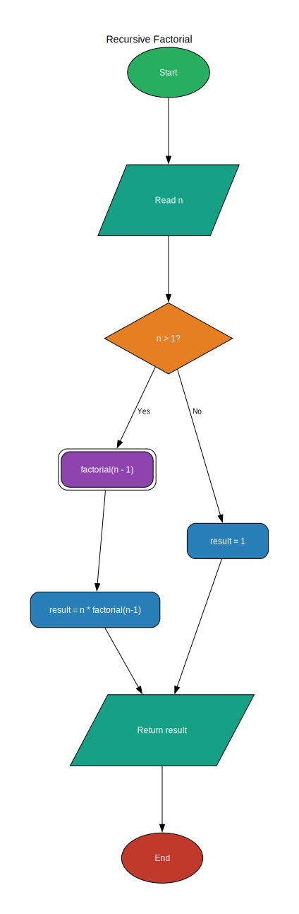
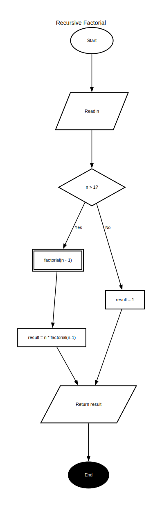
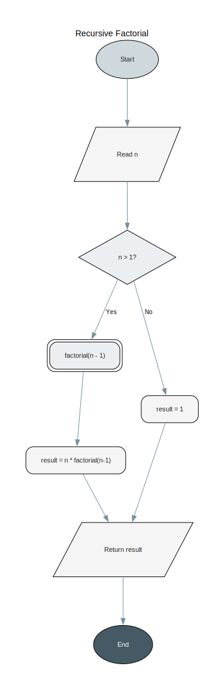

# flowchart-mcp-server

A local MCP server that lets Claude generate academic-quality flowcharts from natural language or code.

You describe what you want — or connect a codebase via the filesystem connector — and Claude constructs the full graph. The server renders it into a clean SVG using Graphviz.

## Prerequisites

- [Python 3.12+](https://www.python.org/downloads/)
- [uv](https://docs.astral.sh/uv/getting-started/installation/)
- [Graphviz](https://graphviz.org/download/) — must be on your `PATH`

Install Graphviz for your OS:

```sh
# Windows
winget install graphviz

# macOS
brew install graphviz

# Debian / Ubuntu
sudo apt install graphviz
```

Verify it's installed:

```sh
dot -V
```

## Installation

```sh
git clone https://github.com/your-username/flowchart-mcp-server
cd flowchart-mcp-server
uv sync
```

## Connecting to Claude Desktop

Open your Claude Desktop config file:

- **macOS**: `~/Library/Application Support/Claude/claude_desktop_config.json`
- **Windows**: `%APPDATA%\Claude\claude_desktop_config.json`

Add the server under `mcpServers`:

```json
{
  "mcpServers": {
    "flowchart": {
      "command": "uv",
      "args": [
        "run",
        "--directory",
        "/absolute/path/to/flowchart-mcp-server",
        "python",
        "server.py"
      ]
    }
  }
}
```

Replace the path with the actual location on your machine, then restart Claude Desktop.

## Usage

Once connected, talk to Claude naturally:

> "Draw a flowchart of the binary search algorithm"

> "Create an academic-style flowchart of how TCP handshakes work"

> "Read my `auth.py` and generate a flowchart of the login flow" *(requires filesystem connector)*

Charts are returned inline and saved as SVG to the `charts/` folder.

### Styles

| Style | Description |
|-------|-------------|
| `colorful` | Vibrant colour-coded nodes (default) |
| `academic` | Black & white, thick borders — suitable for papers and theses |
| `minimal` | Soft greys, clean modern look |

Specify a style in your prompt: *"...use the academic style"*

| | colorful | academic | minimal |
|---|---|---|---|
| |  |  |  |

### Node types

| Type | Shape | Used for |
|------|-------|----------|
| `start` | Oval | Entry point |
| `end` | Oval | Exit point |
| `process` | Rectangle | Computation or action |
| `decision` | Diamond | Branch / condition |
| `io` | Parallelogram | Input or output |
| `subprocess` | Double rectangle | Named function call |
| `connector` | Small circle | Off-page connector |
| `annotation` | Note | Clarifying comment |

## Project structure

```
flowchart-mcp-server/
├── server.py        # MCP server
├── charts/          # Generated SVG output
├── pyproject.toml
└── uv.lock
```